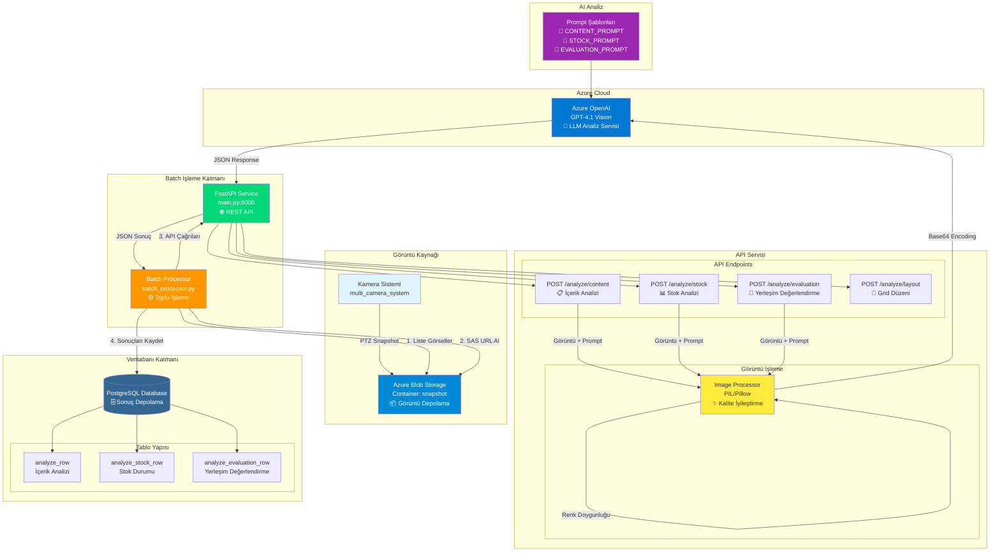
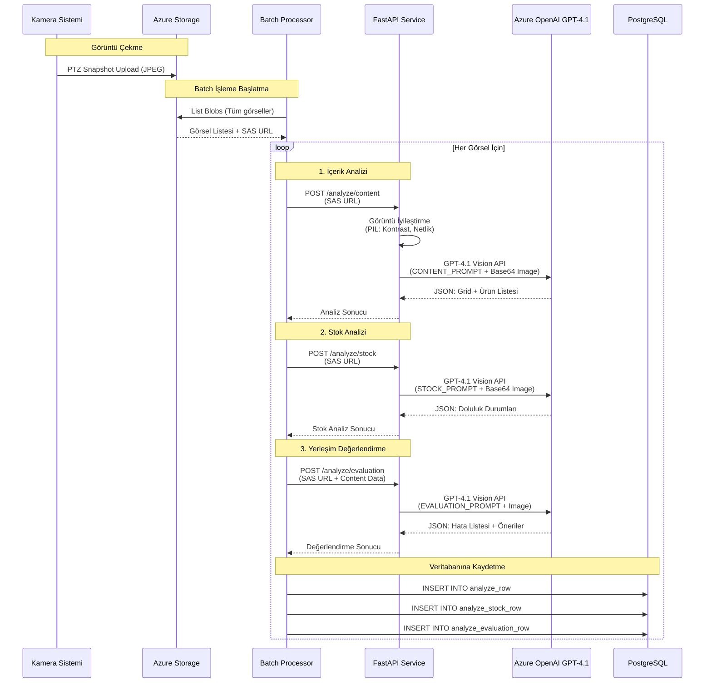

# Manav Analiz Sistemi - Mimari Diagram

## Sistem Mimarisi



## Veri Akışı (Data Flow)



## Sistem Bileşenleri Detayı

### 1. Görüntü Kaynağı
- **Kamera Sistemi**: PTZ kameralardan snapshot alır
- **Format**: JPEG görüntüler
- **Hedef**: Azure Blob Storage'a yüklenir

### 2. Azure Blob Storage
- **Container**: `snapshot`
- **Fonksiyon**: Görüntü deposu
- **Erişim**: SAS Token ile güvenli erişim

### 3. Batch Processor
- **Dosya**: `batch_processor.py`
- **Modlar**:
  - **Mod 1**: Tam Analiz (Content + Stock + Evaluation)
  - **Mod 2**: Sadece Stock Analizi (Hızlı)
- **Özellikler**:
  - Batch işleme (default: 10 görsel/batch)
  - Retry mekanizması (3 deneme)
  - İlerleme takibi ve logging

### 4. FastAPI Service
- **Port**: 8000
- **Endpoints**:
  1. `/analyze/content` - Reyon içerik analizi
  2. `/analyze/stock` - Stok/doluluk analizi
  3. `/analyze/evaluation` - Yerleşim değerlendirmesi
  4. `/analyze/layout` - Grid düzeni tespiti

### 5. Görüntü İşleme Pipeline
```
Input Image → PIL Enhancement → Base64 Encoding → GPT-4.1 API
```
- **Kontrast Artırma**: %15
- **Netlik Artırma**: %10
- **Renk Doygunluğu**: %5
- **Çözünürlük**: Max 2560x1920 (Aspect ratio korunur)
- **Kalite**: JPEG 98% quality

### 6. Azure OpenAI GPT-4.1
- **Model**: GPT-4.1 Vision
- **API Version**: 2024-12-01-preview
- **Prompts**:
  - **CONTENT_PROMPT**: Meyve/sebze tanıma (detaylı)
  - **STOCK_PROMPT**: Stok seviyesi analizi (basit)
  - **EVALUATION_PROMPT**: Etilen kurallarına göre değerlendirme
- **Parameters**:
  - Max Tokens: 1500
  - Temperature: 0.2
  - Top-P: 0.9

### 7. PostgreSQL Veritabanı
- **Tablolar**:
  - `analyze_row`: İçerik analizi sonuçları (grid, ürünler, konumlar)
  - `analyze_stock_row`: Stok durumu (doluluk seviyeleri, özet)
  - `analyze_evaluation_row`: Yerleşim hataları ve öneriler

## Teknoloji Stack

### Backend
- **Python 3.x**
- **FastAPI** - REST API framework
- **Uvicorn** - ASGI server

### Cloud Services
- **Azure Blob Storage** - Görüntü depolama
- **Azure OpenAI** - GPT-4.1 Vision modeli

### Database
- **PostgreSQL** - İlişkisel veritabanı
- **Psycopg2** - PostgreSQL adapter

### Image Processing
- **Pillow (PIL)** - Görüntü işleme ve iyileştirme

### Utilities
- **Python-dotenv** - Environment variables
- **Requests** - HTTP client
- **Logging** - Sistem logları

## Güvenlik ve Konfigürasyon

### Environment Variables (.env)
```bash
# Azure Storage
AZURE_STORAGE_CONNECTION_STRING=...
AZURE_CONTAINER_NAME=snapshot
AZURE_SAS_TOKEN=...

# Azure OpenAI
AZURE_OPENAI_ENDPOINT=https://...
AZURE_OPENAI_API_KEY=...
AZURE_OPENAI_DEPLOYMENT=gpt-4.1
AZURE_API_VERSION=2024-12-01-preview

# PostgreSQL
POSTGRES_HOST=localhost
POSTGRES_PORT=5432
POSTGRES_DB=...
POSTGRES_USER=...
POSTGRES_PASSWORD=...

# API Configuration
API_BASE_URL=http://localhost:8000
BATCH_SIZE=10
RETRY_COUNT=3
REQUEST_DELAY=1.0
```

## Performans Özellikleri

- **Batch İşleme**: Toplu görsel işleme
- **Retry Mekanizması**: Başarısız istekler için 3 deneme
- **Request Throttling**: İstekler arası gecikme (default: 1s)
- **Progress Tracking**: İlerleme takibi ve loglama
- **Error Handling**: Kapsamlı hata yönetimi

## Kullanım Senaryoları

### Senaryo 1: Tam Analiz
```
Batch Processor → Content API → Stock API → Evaluation API → PostgreSQL
```

### Senaryo 2: Hızlı Stock Kontrolü
```
Batch Processor → Stock API → PostgreSQL
```

### Senaryo 3: Manuel API Çağrısı
```
Client → FastAPI → Azure OpenAI → JSON Response
```

